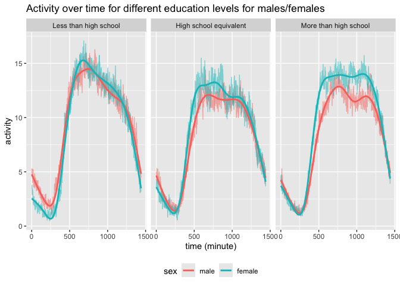

p8105_hw3_jl6521
================
Jiayi
2024-10-10

## Problem 1

``` r
data("ny_noaa")
size = nrow(ny_noaa)
column = ncol(ny_noaa)
cleaned_noaa = ny_noaa %>% 
  separate(date, into = c("year","month","day"), sep="-") 
```

Description of the dataset: the dataset consists of records from 2595176
weather stations around the world with 7 daily variables. They are ids,
maximum and minimum temperature, total daily precipitation, snowfall,
and snow depth.

\*and indicating the extent to which missing data is an issue. \##
Problem 2

``` r
acc_data = read_csv("./data/nhanes_accel.csv",
                    na = c("NA", ".", "")
                    ) %>% 
  janitor::clean_names()
```

    ## Rows: 250 Columns: 1441
    ## ── Column specification ────────────────────────────────────────────────────────
    ## Delimiter: ","
    ## dbl (1441): SEQN, min1, min2, min3, min4, min5, min6, min7, min8, min9, min1...
    ## 
    ## ℹ Use `spec()` to retrieve the full column specification for this data.
    ## ℹ Specify the column types or set `show_col_types = FALSE` to quiet this message.

``` r
demo_data = read_csv("./data/nhanes_covar.csv",
                     skip = 4,
                     na = c("NA", ".", "")
                     ) %>% 
  janitor::clean_names()
```

    ## Rows: 250 Columns: 5
    ## ── Column specification ────────────────────────────────────────────────────────
    ## Delimiter: ","
    ## dbl (5): SEQN, sex, age, BMI, education
    ## 
    ## ℹ Use `spec()` to retrieve the full column specification for this data.
    ## ℹ Specify the column types or set `show_col_types = FALSE` to quiet this message.

``` r
merged_mims = inner_join(demo_data,acc_data, by = "seqn") %>%
  filter(age >= 21) %>%
  drop_na(sex, age, bmi, education) %>%
  mutate(sex = factor(sex,
         levels = c(1,2),
         labels = c("male", "female"))
         ) %>% 
  mutate(education = factor(education,
         levels = c(1,2,3),
         labels = c("Less than high school", 
                    "High school equivalent",
                    "More than high school")))
```

``` r
education_table = merged_mims %>% 
  group_by(education,sex) %>% 
  summarize(
    number = n(),
    .groups = 'drop'
  ) %>% 
  pivot_wider(
    names_from = sex,
    values_from = number
  )  
education_table %>% 
  kable(
    col.names = c("Education level", "Female", "Male"),
    caption = "Number of Men and Women by Education Category",
    align = "c"
  )
```

|    Education level     | Female | Male |
|:----------------------:|:------:|:----:|
| Less than high school  |   27   |  28  |
| High school equivalent |   35   |  23  |
| More than high school  |   56   |  59  |

Number of Men and Women by Education Category

``` r
education_visualization = ggplot(merged_mims,aes(x= education, y = age, color = sex)) + 
  geom_boxplot(alpha = 0.5) + 
  labs(
    title = "Age Distribution by Education and Sex",
    x = "Education Level",
    y = "Age"
  ) + 
  theme_minimal()

print(education_visualization)
```

<!-- -->
Comment: From the plot, we can see that the age of the people with more
than high school degree is usually lower than the other two education
levels. The age of males and females are similar for both less than high
school group and more than high school group, but not the high school
equivalent group. In the high school equivalent group, the age of
females is higher htan the males.

``` r
agg_data =
  merged_mims %>% 
  mutate(
    total_activity = rowSums(across(starts_with("min")),na.rm = TRUE)
  )%>%
  select(seqn,sex,age,bmi,education,total_activity,everything())

agg_visualization = agg_data %>% 
  ggplot(aes(x=age,y=total_activity,color = sex))+
  geom_point(alpha = 0.5) +
  geom_smooth(se = FALSE) +
  facet_grid(. ~ education) + 
  labs(
    title = "Total Activities against age",
    y = "total activity"
  )+
  theme_minimal()

print(agg_visualization)
```

    ## `geom_smooth()` using method = 'loess' and formula = 'y ~ x'

<!-- -->
Comment: \* For the less than high school group, the total activity of
males and females decrease as age increase, except for a peak around age
60 when the total activities of two group increase from 45 to 60. Before
40 years old, the total activity of females are larger than of males,
but after 40 years old, total activities for males are larger than
females. \* For the high school equivalent group, the total activity
increase at first when age is small and then decreases as females and
male get older. For females, there’s an small increase again at later
age but not for males. Generally females have higher total activity than
males except for the initial time. \* For the more than high school
group, the total activity of females is larger than the males all the
time.

``` r
time_plot = merged_mims %>% 
  pivot_longer(
    cols = min1:min1440,
    names_to = "time",
    values_to = "activity"
  ) %>% 
  group_by(education, sex, time) %>% 
  summarize(mean_activity = mean(activity, na.rm = TRUE)) %>%
  mutate(time = as.numeric(gsub("min", "", time))) %>%
  ggplot(aes(x=time,y=mean_activity,color = sex))+
  geom_line(alpha = 0.5) +
  geom_smooth(se = FALSE)+
  facet_grid(. ~ education) + 
  labs(
    title = "Activity over time for different education levels for males/females",
    x = "time (minute)",
    y = "activity"
  ) +
  theme_minimal()
```

    ## `summarise()` has grouped output by 'education', 'sex'. You can override using
    ## the `.groups` argument.

``` r
print(time_plot)
```

    ## `geom_smooth()` using method = 'gam' and formula = 'y ~ s(x, bs = "cs")'

<!-- -->

## Problem 3

``` r
jan20 = read_csv("./data/citibike/Jan 2020 Citi.csv",
                    na = c("NA", ".", ""), show_col_types = FALSE)%>% 
  janitor::clean_names()
jan24 = read_csv("./data/citibike/Jan 2024 Citi.csv",
                    na = c("NA", ".", ""),show_col_types = FALSE)%>% 
  janitor::clean_names()
july20 = read_csv("./data/citibike/July 2020 Citi.csv",
                    na = c("NA", ".", ""),show_col_types = FALSE)%>% 
  janitor::clean_names()
july24 = read_csv("./data/citibike/July 2024 Citi.csv",
                    na = c("NA", ".", ""),show_col_types = FALSE)%>% 
  janitor::clean_names()
```

Description: the dataset records the ride ID, ride type, the day of the
ride, duration of the ride, start and end station time, and also if it’s
citi bike member or casual riders.

``` r
jan20_new = jan20 %>% 
  group_by(member_casual) %>% 
  summarize(Janurary2020 = n())

jan24_new = jan24 %>% 
  group_by(member_casual) %>% 
  summarize(Janurary2024 = n())

july20_new = july20 %>% 
  group_by(member_casual) %>% 
  summarize(July2020 = n())

july24_new = july24 %>% 
  group_by(member_casual) %>% 
  summarize(July2024 = n())

full_table = jan20_new %>% 
  left_join(jan24_new, by = "member_casual") %>% 
  left_join(july20_new, by = "member_casual") %>%
  left_join(july24_new, by = "member_casual") %>%   knitr::kable(
  caption = "Total number of rides at each time",
  cols.names = c("Member or casual", "Janurary 2020", "Janurary 2024", "July 2020", "July 2024")
  )
print(full_table)
```

    ## 
    ## 
    ## Table: Total number of rides at each time
    ## 
    ## |member_casual | Janurary2020| Janurary2024| July2020| July2024|
    ## |:-------------|------------:|------------:|--------:|--------:|
    ## |casual        |          984|         2108|     5637|    10894|
    ## |member        |        11436|        16753|    15411|    36262|
